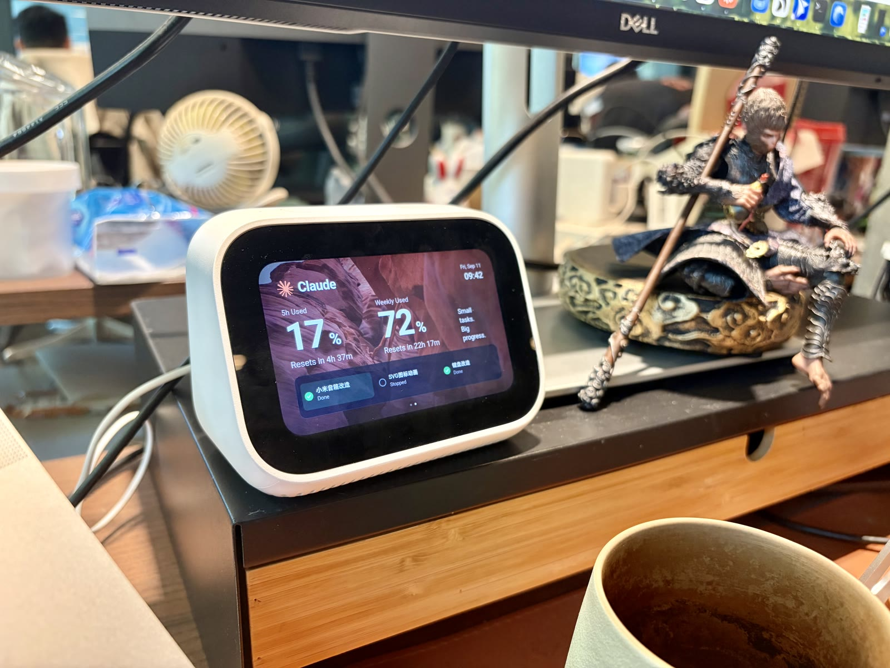
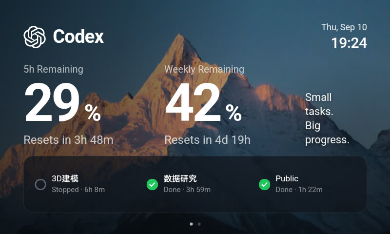
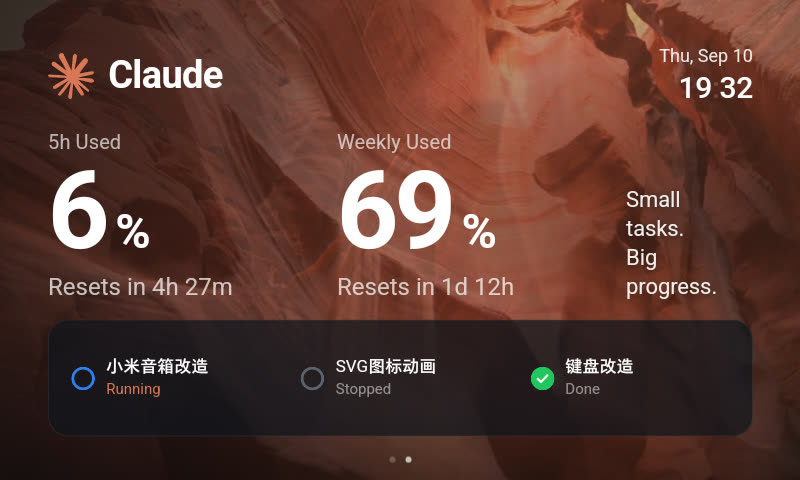

# LX04 状态屏

把一台闲置的小米小爱触屏音箱，变成桌上的 AI 编码状态屏。



Codex 和 Claude 正在干什么、额度还剩多少、哪个任务卡住了需要你回去看一眼——
抬头一瞥就知道，不用切回终端翻窗口。

---

## 它长什么样

左右滑动切换两页，一页 Codex，一页 Claude。

| Codex | Claude |
| --- | --- |
|  |  |

每页从上到下是三块：

- **抬头** —— 谁的页面，加当前时间（冒号每秒闪一下，一眼看出屏没死）
- **额度** —— 两个窗口的用量，和各自的重置倒计时。Codex 显示「还剩多少」，Claude 显示「已用多少」，各自对齐官方的说法
- **最近三个会话** —— 项目名、状态、累计耗时。刚完成的会亮一层绿底，持续 10 分钟

背景是循环播放的视频，不是静态图。

---

## 你需要准备

**硬件**

- 小米小爱触屏音箱 LX04（闲鱼上很便宜），**必须先刷机**——原系统没有可用的浏览器。刷机步骤见 [docs/刷机手册.md](docs/刷机手册.md)，有变砖风险，自己掂量
- 一台 Mac，和音箱在同一个 Wi-Fi 下

**软件**

- 你在用 Codex CLI 或者 Claude Code（至少一个，两个都用效果最好）
- Python 3.11+
- 音箱上装一个能全屏的浏览器，推荐 [Via](https://viayoo.com/)（体积小，能隐藏地址栏）

> 状态屏只读本地文件，不连任何云服务，也不需要小米账号。
> （除非你要开语音播报，见[下面](#可选打开语音播报)）

---

## 跑起来

### 1. 拉代码，装依赖

```bash
git clone <这个仓库的地址> && cd lx04-status-display
```

这个项目站在 [yihong0618/mibe](https://github.com/yihong0618/mibe) 上——它负责盯 Codex 的会话日志。
把它拉到 `vendor/` 下，再打上我们的补丁：

```bash
git clone https://github.com/yihong0618/mibe.git vendor/mibe
cd vendor/mibe && git apply ../mibe.patch && uv sync && cd ../..
```

补丁只有 25 行，做的事都记在 [docs/使用说明.md](docs/使用说明.md) 的「我们改了 mibe 什么」里。

### 2. 启动

```bash
./scripts/start.sh
```

它会打印两个地址：

```
状态屏  http://192.168.x.x:8477/
接口    http://192.168.x.x:8477/api/status
```

先在 Mac 浏览器打开第一个，确认能看到画面。

### 3. 在音箱上打开

音箱浏览器里输入同一个地址，全屏。完事。

---

## 让它一直在

上面那条命令跑在终端里，关掉终端或者重启 Mac 就没了。装成开机自启：

```bash
./scripts/install-agent.sh
```

之后：登录 macOS 自动起、进程挂了自动拉起、重启不用管。

| 干什么 | 命令 |
| --- | --- |
| 看日志 | `tail -f ~/Library/Logs/lx04-status.log` |
| 改完代码重启 | `launchctl kickstart -k gui/$(id -u)/com.lx04.status` |
| 卸载 | `launchctl unload ~/Library/LaunchAgents/com.lx04.status.plist && rm ~/Library/LaunchAgents/com.lx04.status.plist` |

---

## 状态怎么看

| 显示 | 含义 |
| --- | --- |
| **Running** | 正在干活 |
| **Your turn** | 停下来等你——在问问题或请求授权。**这个会橙色呼吸，是最该看的** |
| Done | 完成。刚完成的 10 分钟内有绿底 |
| Stopped | 被你中断，或者超过 15 分钟没动静 |

额度数字平时是白的，剩得不多时转橙、见底转红。**平时不喊，喊了才有人听。**

连不上 Mac 时整屏转灰、时钟的冒号停住——一眼能分清是「没任务」还是「断了」。

---

## 换成你自己的背景

`display/` 下的 `meili.mp4`（雪山）和 `canyon.mp4`（峡谷）是已经处理好的，直接能用。

想换成自己的素材，注意这几条——都是踩出来的：

**尺寸做成 800×480**，和屏幕严格一致。不要指望 `object-fit` 帮你兜底。

**调色烘进视频文件，别用 CSS filter。** 每帧多跑一次色彩矩阵，这台机器的 GPU 扛不住。

**编码用 H.264，像素格式 `yuv420p`**。这机器没有 VP8/VP9/AV1 解码器。

**循环必须首尾同帧**，否则每转一圈跳一下。两个办法：正放接倒放（pingpong），或者把开头几帧挪到片尾用溶解接回来。

一条能直接用的命令（按需改 `crop` 取景）：

```bash
ffmpeg -i 你的素材.mov \
  -filter_complex "[0:v]fps=24,crop=3600:2160:120:0,scale=800:480,format=yuv420p[v];\
[v]split[a][b];[b]reverse,trim=start_frame=1,setpts=PTS-STARTPTS[r];[a][r]concat=n=2:v=1[out]" \
  -map "[out]" -an -c:v libx264 -profile:v high -pix_fmt yuv420p \
  -crf 21 -g 48 -movflags +faststart -y display/你的背景.mp4
```

然后改 `display/index.html` 里的 `SRC`。

**视频放不出来时会自动退回静态图**（`display/*.jpg`），所以不会黑屏。

---

## 它是怎么工作的

```
Codex 会话日志 ┐
~/.codex/       ├→ bridge/run.py ─→ HTTP :8477 ─→ 音箱浏览器
Claude 会话日志 ┘    （每 2 秒一次快照）         （每 2 秒拉一次）
~/.claude/
```

- **Codex 侧**：mibe 盯 `~/.codex/sessions/` 的事件流
- **Claude 侧**：`bridge/claude.py` 直接读 `~/.claude/projects/` 的 `.jsonl`；额度来自 Claude Desktop 的本地缓存
- **页面**：一个 HTML 文件，无框架无构建。因为音箱的 WebView 是 **Chromium 61**（2017 年），`inset`、flex `gap`、`backdrop-filter`、可变字体全都不支持

没有数据库，没有账号体系，重启就是重新读一遍。

---

## 遇到问题

**只露出左上角一块、字特别大**
viewport 被锁死了。这块屏物理 800×480，但浏览器眼里只有 534×320（dpr=1.5）。确认 `index.html` 的 viewport 那行没被改坏。

**背景不动 / 显示成静态图**
视频没解出来，退回图片层了。打开 `http://<你的Mac>:8477/_v.html`，那页会把 `readyState`、`error`、元素尺寸都列出来。

**刷新之后就不动了**
这是我们踩过的坑：Chromium 61 缓存分片响应的行为不可靠，会把半个文件存住。所以服务端对视频一律 `no-store`。如果你改过缓存策略，改回去。

**上滑把整个页面顶上去了**
浏览器的地址栏在抢手势。页面已经用 `touch-action: pan-y` 和磁吸做了限制，但不同浏览器表现不同，建议用 Via 并打开「全屏」。

更多细节在 [docs/使用说明.md](docs/使用说明.md)。

---

## 鸣谢

- **[影视飓风](https://space.bilibili.com/946974)** —— 背景视频来自他们公开的免费样片。仓库里的是经过裁切、调色、重编码和循环重排的衍生片段，不是原片
- **[yihong0618/mibe](https://github.com/yihong0618/mibe)**（MIT）—— Codex 侧的事件采集和小爱音箱播报，这个项目是踩在它肩上做的
- **[Unsplash](https://unsplash.com/)** —— 兜底用的静态背景图
- **Roboto**（Apache 2.0）—— 界面字体。它是 Android 原生字体，这样 Mac 预览和真机显示才一致

---

## 可选：打开语音播报

除了看屏，还能让音箱把状态念出来。这一步需要小米账号（走 mibe 的能力）：

```bash
export MI_USER=你的小米账号
export MI_PASS=你的密码
./scripts/start.sh --speak
```

账号只在本地用于登录小米云服务，不经过任何第三方。**开机自启默认不带播报**——LaunchAgent 读不到你 shell 里的环境变量，硬塞进配置文件等于把账号明文写在磁盘上。

---

## License

MIT，见 [LICENSE](LICENSE)。

背景视频和图片不适用本许可证，版权归各自作者所有，见上面的鸣谢。
